# Web Application Programming and Hacking

## Instructor: Dr. Phu Phung

## Student

**Name**: Navatej Reddy Muddam

**Email**: [muddamn1@udayton.edu](muddamn1@udayton.edu)

## Repository Information

Repository's URL: [https://github.com/muddamn1/waph-muddamn1.git](https://github.com/muddamn1/waph-muddamn1.git)

This is a private repository for Navatej Reddy to store all the code from the course. The organization of this repository is as follows.

### Labs

[Hands-on exercises in Lectures](labs)

- [Lab 0](labs/lab0): Development Environment Setup
- [Lab 1](labs/lab1): Foundations of the Web
- [Lab 2](labs/lab2): Front-end Web Development
- [Lab 3](labs/lab3): Secure Web Application Development in PHP/MySQL
- [Lab 4](labs/lab4): A Secure Login System with Session Authentication

### Hackathons

- [Hackathon 1](hackathon1): Cross-site Scripting Attacks and Defenses
- [Hackathon 2](hackathon2): SQL Injection Attacks
- [Hackathon 3](hackathon3): Session Hijacking Attacks and Defenses

### Individual Projects

- [Individual Project 1](): Front-end Web Development with a Professional Profile Website and API Integration on github.io cloud service
- [Individual Project 2](): Secure Full-stack Web Application Development

## Report

## The Project's overview

This project involved building a secure full-stack web application using PHP and MySQL, focusing on user authentication, profile management, and password updates. Key features included a registration system, secure login with session handling, profile editing, and CSRF protection. The UI was built using HTML, CSS, and JavaScript, with a focus on responsive and user-friendly design. The application enforced strong password policies, used hashed passwords, and implemented both client-side and server-side input validation to defend against XSS and SQL injection attacks. Through this project, I developed practical skills in secure coding, form validation, and session-based user management.

Project's URL: [Individual Project 2](https://github.com/muddamn1/muddamn1-waph-project2)

Demo's URL: [Video Demo](https://drive.google.com/file/d/1-vnv17nXY6HJO20aHx0b66Vy-qmQWGtc/view?usp=sharing)

## Part 1 - Functional Requirements

#### Task 1.A:  User Registration

For the user registration component, I created a registration form where users could enter their username, password, full name, and email. Client-side validations were implemented using HTML5 attributes and regex patterns to ensure valid inputs. On the server side, all inputs were sanitized using htmlspecialchars() and trimmed before being processed. Passwords were hashed using md5() before storing them in the database. Duplicate usernames were checked in advance to avoid conflicts, and prepared statements were used throughout to defend against SQL injection.

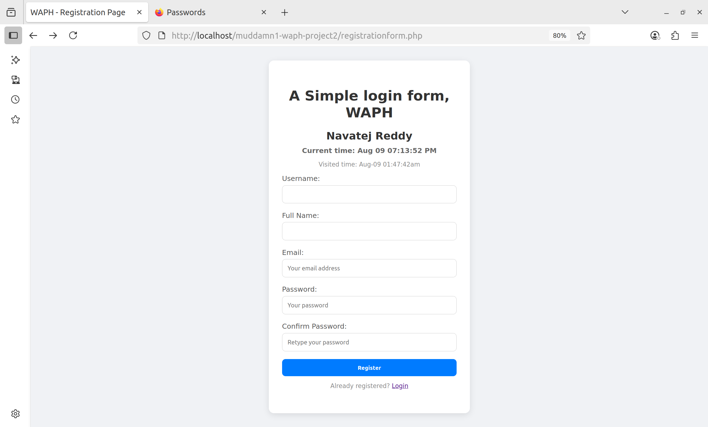{ width=400px }

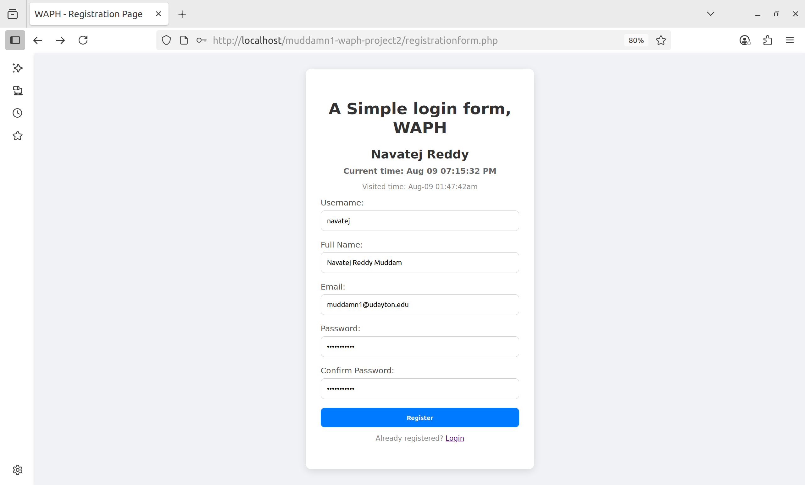{ width=400px }

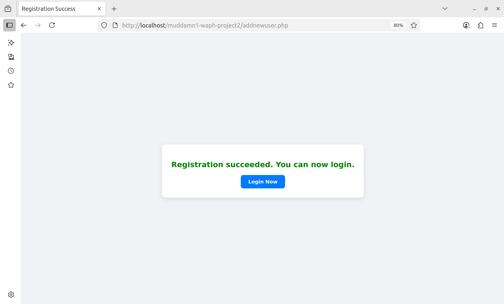{ width=400px }

#### Task 1.B: Login

The login system used session management to authenticate users. Once credentials were validated using hashed passwords, PHP sessions were initialized and stored essential session variables such as username and user agent to help detect hijacking attempts. If authentication failed, users received an alert and were redirected to the login page to retry.

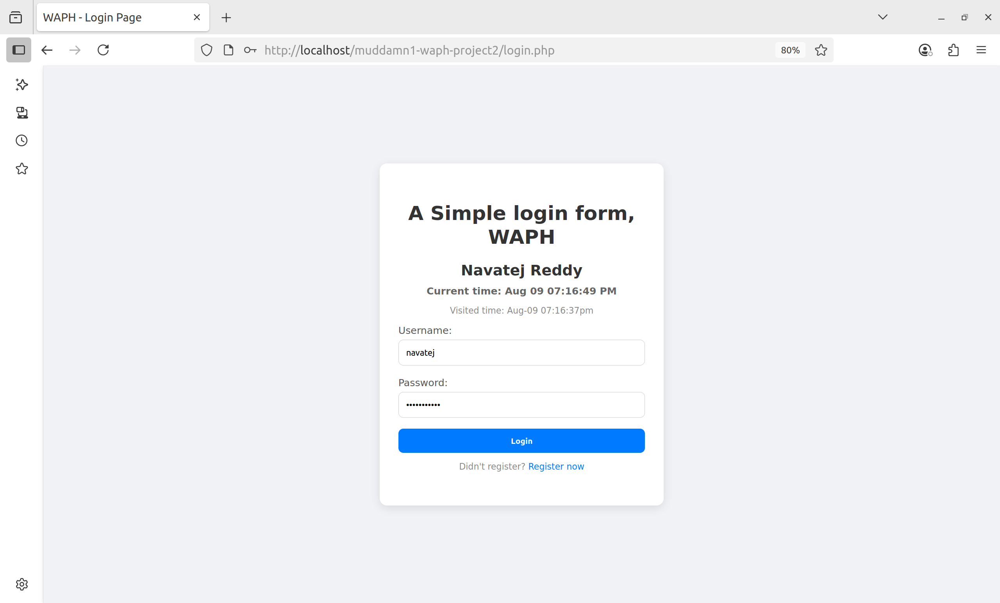{ width=400px }

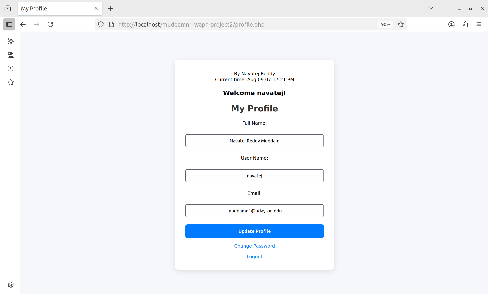{ width=400px }

#### Task 1.C: Profile Management

The profile management page allowed users to view and update their name, email, and username. The form fields were pre-filled with existing values pulled from the database, and changes were only saved if new input differed from the current data. I ensured that all user input was sanitized and updates were executed via prepared statements. Additionally, CSRF protection was enforced using anti-CSRF tokens, which were generated at session start and verified during submission.

{ width=400px }

#### Task 1.D: Password Update 

The password update feature allowed authenticated users to change their password securely. Input was validated on the client side to enforce strong password criteria and sanitized on the server side. Passwords were stored using md5() hashing, and only non-empty values were accepted. A success or failure message was displayed based on whether the password was successfully updated in the database.

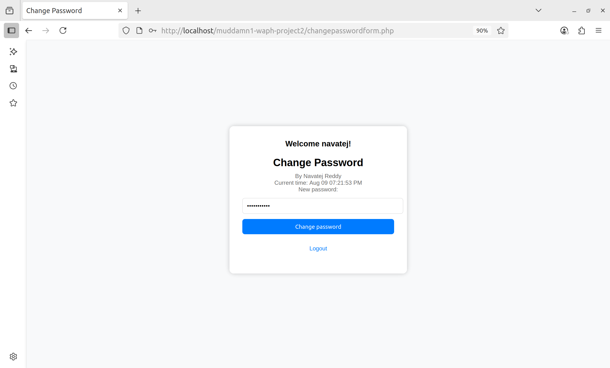{ width=400px }

{ width=400px }

### Task 2: Security and Non-technical Requirements

#### Task 2.A: Security

For security implementation, I ensured that no MySQL root accounts were used in the code. All database interactions were handled via prepared statements. Session management was handled securely by starting sessions on each authenticated page and destroying them upon logout to prevent fixation or hijacking.

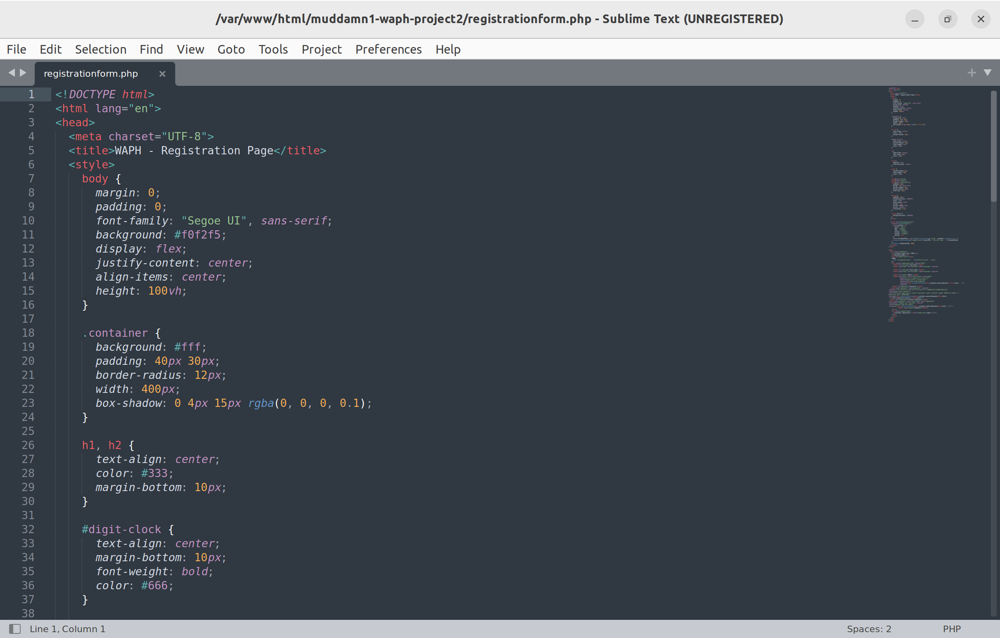{ width=400px }

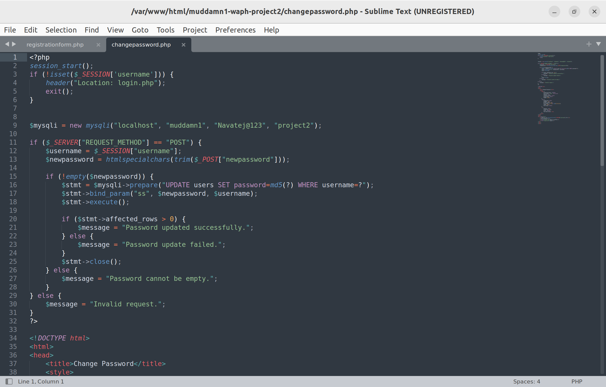{ width=400px }

#### Task 2.B: Input Validation    

Input validation was thoroughly applied on both the front-end and back-end. HTML5 validation patterns were used in the registration and password forms, while all user input was sanitized using a dedicated sanitize_input() function to mitigate XSS attacks and enforce consistent input hygiene. The database schema included a user table with columns for username, fullname, email, and hashed password, all of which were stored securely.

{ width=400px }

{ width=400px }

#### Task 2.C: Database Design   

I tested the application for XSS by injecting a JavaScript snippet into a form input. Since the application did not sanitize the output before reflecting it back onto the page, the script was executed and displayed an alert box containing the session cookie. This demonstrated a stored/reflected XSS vulnerability.

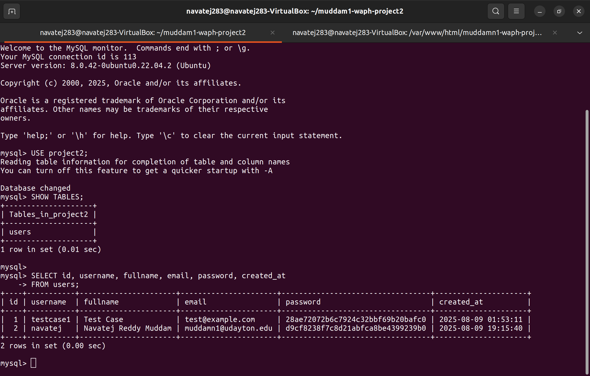{ width=400px }

#### Task 2.D: Front-end Development

The front-end was designed to be clean and responsive using internal CSS. Each page, including registration, login, profile, and change password—maintained a consistent visual style and responsive layout, ensuring usability across devices.

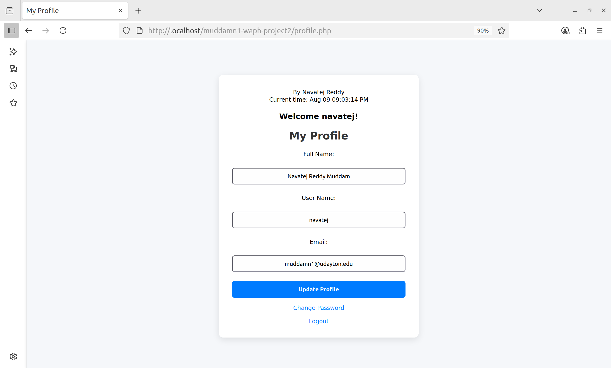{ width=400px }

#### Task 2.E: Session Management    

Session management was enforced across all secure pages by checking for active user sessions and redirecting unauthorized users to the login page. Upon logout, session variables were cleared and the session was destroyed. 

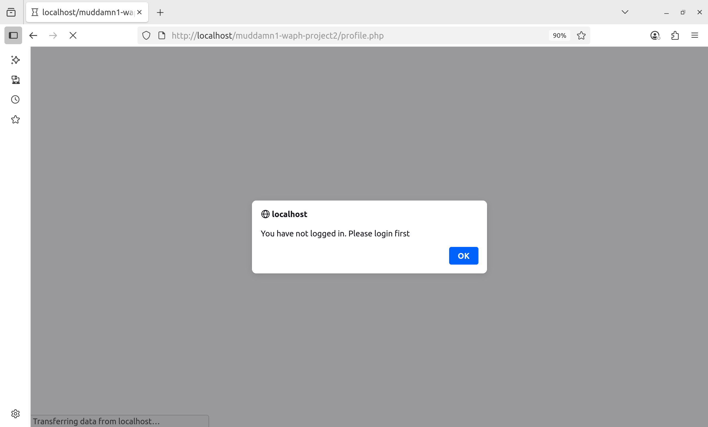{ width=400px }

#### Task 2.F: CSRF Protection  

For CSRF protection, anti-CSRF tokens were used on all forms that modified data—such as updating profile information—ensuring that only legitimate user actions could trigger sensitive operations. If a CSRF attack is performed, it will have a dropdown box saying "CSRF attack detected" and automatically redirects the page to the login page after 5 seconds. 

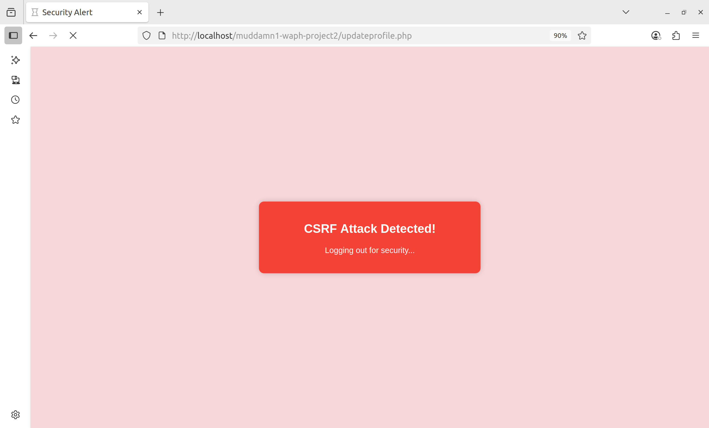{ width=400px }

